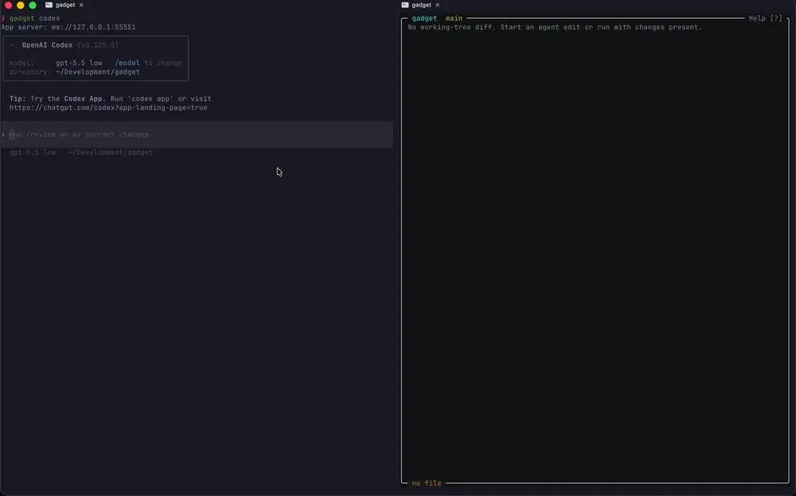

# Gadget

Gadget is a terminal diff reviewer for coding-agent sessions.

It watches a working tree, renders live file diffs, lets you attach comments to diff lines, and can either copy comments to your clipboard or connect them to a live Codex, Claude, or Pi session.

## Quick Demonstration



## Key Features

- Live terminal diff viewer for active coding-agent worktrees.
- Inline comments on specific diff lines.
- Clipboard review mode for copying comments into any agent or chat.
- Connected Codex mode for sending review comments back to a live session.
- Optional cmux-backed Claude mode for sending review comments to the current Claude pane.
- Pi bridge mode for sending review comments to active Pi sessions.
- Full-file view, file search, diff-base selection, and keyboard-first navigation.

## Install

The installer bootstraps Bun if needed. Claude integration requires cmux. Pi support requires the Gadget Pi extension, which the installer can optionally install.

```bash
bash install.sh
```

Verify the install:

```bash
gadget --help
```

## Quick Start

```bash
# Start Codex with Gadget app-server integration.
gadget codex

# Or start Claude. This works best with cmux enabled.
gadget claude

# Or start Pi with Gadget bridge integration.
gadget pi

# Or install only the Pi extension so plain `pi` sessions can connect to Gadget.
pi install ./pi-extension

# Connect to your running agent from another terminal pane.
gadget
```

`gadget claude` uses cmux only when `[integrations].cmux` is enabled and the command is run inside a cmux terminal pane. Review comments are pasted into that Claude pane as one multiline message. If cmux integration is disabled, `gadget claude` runs the Claude CLI normally.

## Configuration

Gadget reads `$HOME/.gadget/config.toml` by default. Diff rendering uses split columns automatically on wide terminals unless forced back to unified mode:

```toml
[diff]
rendering = "auto" # auto | unified
```

## Pi Support

Gadget supports Pi through a small bridge extension. The extension starts a local authenticated bridge inside Pi and registers the live Pi session with Gadget. Gadget keeps its normal OpenTUI review UI in a separate terminal pane, so inline comments, click handling, and review submission use the same interface as the other Gadget modes.

There are two supported ways to use it:

```bash
# One-command launch: starts Pi with the bridge loaded from this checkout.
gadget pi

# Standalone extension install: lets normal `pi` launches register with Gadget.
pi install ./pi-extension
pi
```

After Pi is running, open Gadget from the same git checkout:

```bash
gadget
```

## Keybindings

```text
J            Down
K            Up
G            First line
Shift+G      Last line
Shift+J      Page down
Shift+K      Page up
H            Previous file
L            Next file
P            Open file selector
F            Toggle file tree
Shift+P      Search project files
B            Choose diff base
O            Toggle full file
Enter        Comment
Shift+R      Reply agent turn
S            Session info
?            Keybindings
Shift+Q      Quit
```

## Development Setup

For local agent development, run:

```bash
sh setup.sh
```

The development setup script links the shared agent instructions for Claude compatibility:
`.claude/skills -> ../.agents/skills` and `CLAUDE.md -> AGENTS.md`.
